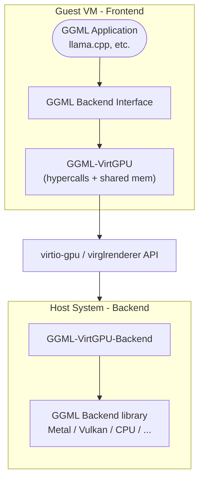

# GGML-VirtGPU Backend

The GGML-VirtGPU backend enables GGML applications to run ML computations on host hardware while the application runs inside a VM. It uses host-guest shared memory for efficient data buffer sharing via virtio-gpu and VirglRenderer API Remoting (APIR).

The backend splits into two libraries:

- **Remoting frontend** (guest): GGML backend interface interacting with the virtgpu device.
- **Remoting backend** (host): VirglRenderer APIR-compatible library interacting with Virglrenderer and an actual GGML device backend.

## OS Support

| OS | Status | Backend | CI Testing | Notes |
|---|---|---|---|---|
| MacOS 14 | Supported | ggml-metal | X | Working when compiled on MacOS 14 |
| MacOS 15 | Supported | ggml-metal | X | Working when compiled on MacOS 14 or 15 |
| MacOS 26 | Not tested | — | — | — |
| Linux | Under development | ggml-vulkan | Not working | Working locally, CI deadlocks |

## Architecture

### Key Components

1. **Guest-side Frontend** (`ggml-virtgpu/`): Implements GGML backend interface, forwards operations to host.
2. **Host-side Backend** (`ggml-virtgpu/backend/`): Receives forwarded operations, executes on actual hardware.
3. **Communication Layer**: virtio-gpu hypercalls and shared memory for data transfer.

## Features

- **Dynamic backend loading** on host (CPU, CUDA, Metal, etc.)
- **Zero-copy data transfer** via host-guest shared memory pages

## Communication Protocol

### Hypercalls and Shared Memory

1. **Hypercalls (`DRM_IOCTL_VIRTGPU_EXECBUFFER`)**: Trigger remote execution from guest to host.
2. **Shared Memory Pages**: Zero-copy tensor and parameter transfer.

#### Shared Memory Layout

- **Data Buffer** (24 MiB): Command/response data and tensor transfers.
- **Reply Buffer** (16 KiB): Command replies and status information.
- **Data Buffers**: Dynamically allocated host-guest shared buffers served as GGML buffers.

### APIR Protocol

Three command types:

- `HANDSHAKE`: Protocol version negotiation and capability discovery.
- `LOADLIBRARY`: Dynamic backend library loading on host.
- `FORWARD`: API function call forwarding.

### Binary Serialization

Custom binary protocol with:

- Fixed-size encoding for basic types
- Variable-length arrays with size prefixes
- Buffer bounds checking
- Error recovery mechanisms

## Supported Operations

| Category | Operations |
|---|---|
| Device | Enumeration, capability queries, memory info, backend type detection |
| Buffer | Allocation/deallocation, tensor data transfer (host ↔ guest), memory copy/clear |
| Computation | Graph execution forwarding |

## Build Requirements

### Guest-side

- `libdrm` for DRM/virtio-gpu communication
- C++20 compiler
- CMake 3.14+

### Host-side

- virglrenderer with APIR support (pending upstream review)
- Target backend libraries (libggml-metal, libggml-vulkan, etc.)

## Configuration

### Environment Variables

| Variable | Purpose |
|---|---|
| `GGML_VIRTGPU_BACKEND_LIBRARY` | Path to host-side backend library |
| `GGML_VIRTGPU_DEBUG` | Enable debug logging |

### Build Options

| Option | Values | Default |
|---|---|---|
| `GGML_VIRTGPU` | `ON`/`OFF` | `OFF` |
| `GGML_VIRTGPU_BACKEND` | `ON`/`OFF`/`ONLY` | `OFF` |

### System Requirements

- VM with virtio-gpu support
- VirglRenderer with APIR patches
- Compatible backend libraries on host

## Limitations

- **VM-specific**: Only works in VMs with virtio-gpu support.
- **Host dependency**: Requires properly configured host-side backend.
- **Latency**: Small overhead from VM escaping per operation.
- **Shared-memory size**: With `libkrun` hypervisor, RAM + VRAM addressable memory limited to 64 GB. Maximum GPU memory = `64GB - RAM`, regardless of hardware VRAM size.

## Pending Upstream

- VirglRenderer: [MR#1590](https://gitlab.freedesktop.org/virgl/virglrenderer/-/merge_requests/1590). Test with Virglrenderer compiled from source using this PR.
- VMM/hypervisor changes needed to route the APIR capset:
  - `VIRGL_ROUTE_VENUS_TO_APIR=1` — uses Venus capset until hypervisors are patched (breaks Vulkan/Venus normal behavior).
  - `GGML_REMOTING_USE_APIR_CAPSET` — tells `ggml-virtgpu` to use the APIR capset (will become default when hypervisors are patched).
- Linux support (via `krun`) is in progress. Main testing platform is MacOS containers.

## See Also

- [[021-backend-virtgpu-development|Development and Testing]]
- [[040-backend-virtgpu-configuration|Backend configuration]]
